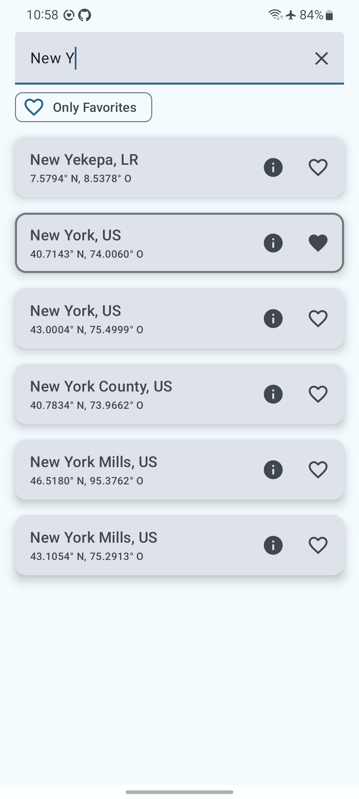
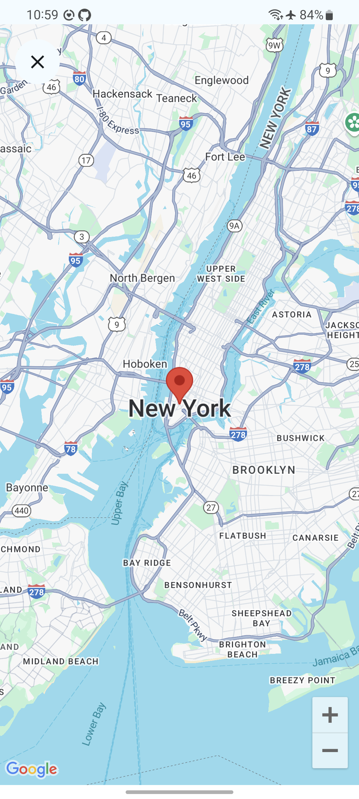
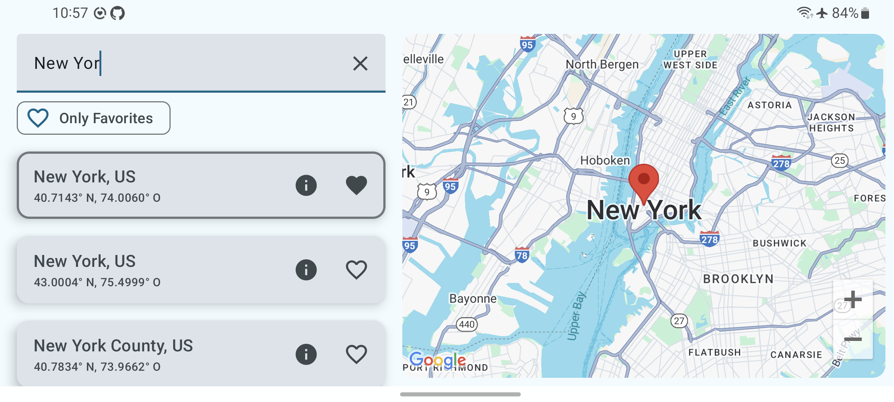
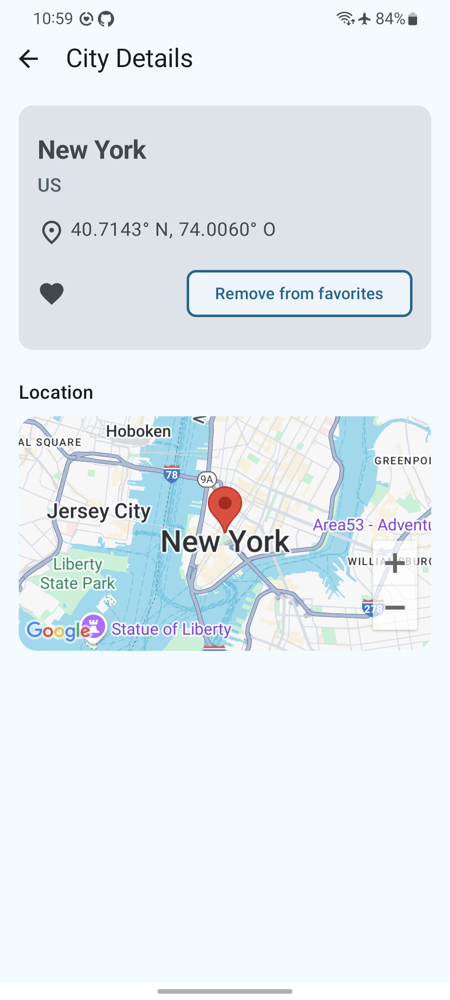
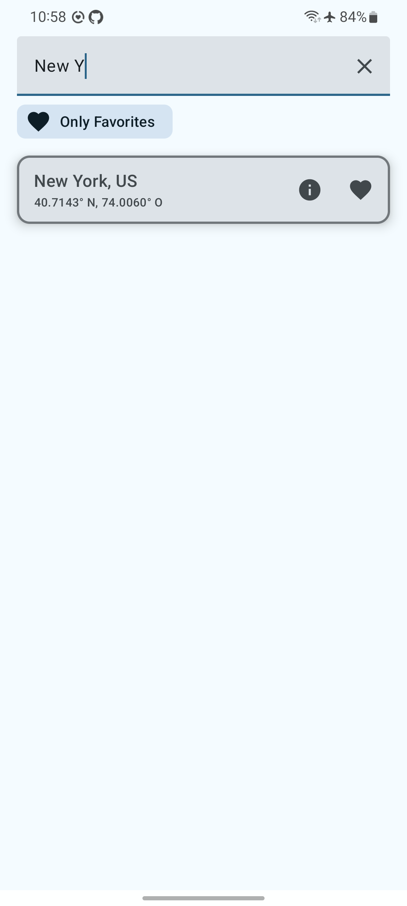

# 🌍 CityExplorer

**CityExplorer** es una app Android construida con **Jetpack Compose** y **Clean Architecture**. Muestra una lista de ciudades del mundo con features como búsqueda, integración con mapas, UI responsiva y soporte offline.

---

## 🚀 Funcionalidades

- ✅ Lista de más de 200.000 ciudades con almacenamiento local (Room)
- 🔍 **Busquedas por prefijo case-sensitive**
- ⭐ Opción de seleccionar ciudades como favoritas
- 🗺️ **Integracion con Google Maps** para mostrar la ciudad seleccionada
- 📱 Responsive UI:
    - **Portrait**: Navega desde la lista de ciudades al Mapa o pantalla de detalles
    - **Landscape**: Muestra la lista de ciudades y el mapa lado a lado
- 🔄 Soporte **Swipe-to-refresh**
- 🧪 **Unit tests y UI tests**
- 🧱 Construida con **Clean Architecture**

---

## 🧰 Tecnologías

| Layer        | Librerias/Herramientas                         |
|--------------|------------------------------------------------|
| UI           | Jetpack Compose, Compose Navigation            |
| Architecture | MVVM, Hilt DI, Clean Architecture              |
| Async        | Kotlin Coroutines, Flow                        |
| Data         | Room, Retrofit                                 |
| Maps         | Google Maps SDK                                |
| Testing      | JUnit, Mockk, Compose UI Test, Coroutines Test |

---

## 🏗 Estructura del Proyecto

```
app/
├── ui/          ← Jetpack Compose, ViewModels
├── domain/      ← UseCases, Models, Interfaces
├── data/        ← Implementación de Repositorios
├── db/          ← Room DAOs y Entities
├── di/          ← Modulos Hilt para DI
```

- **Separation of concerns** con modulos por capa
- **Unidirectional data flow (UDF)**: ViewModel emite estados → UI escucha
- **Sealed classes** para manejo de estados

---

## 📸 Capturas de Pantalla

| Portrait (Lista)                               | Portrait (Mapa)                              |
|------------------------------------------------|----------------------------------------------|
|  |  |

| Landscape                                           |
|-----------------------------------------------------|
|  |

| Detalles                                         | Solo Favoritos                                          |
|--------------------------------------------------|---------------------------------------------------------|
|  |  |

---

## 🔍 Comportamiento de Búsqueda

- **Case-sensitive**
- **Prefix-only** (escribiendo `B` coincide con "Berlin", no con "Albuquerque")

---

## 🧪 Pruebas

- **Unit tests**: ViewModel, UseCases, Filtering
- **UI tests**: Compose `CityListScreen`

---

## 🛠 Instrucciones de Configuración

### 1. Clonar el repo

```bash
git clone https://github.com/jphernandez107/CityExplorer.git
```

### 2. Configurá tu API Key de Google Maps

- Agrega tu API Key en `local.properties`:
```properties
MAPS_API_KEY=your_key_here
```

- Asegurate que tu key está restringida por SHA-1 + nombre del paquete y que tenes habilitado Maps SDK en la consola de google

---

## 💡 Justificación Técnica

Cargar en memoria las más de 200,000 ciudades fue una decisión pensada. Según el enunciado del desafío:

> _“Optimise for fast searches. Loading time of the app is not so important.”_

Este enfoque permite que las búsquedas por prefijo sean instantáneas, sin necesidad de paginación ni lógica de carga incremental, priorizando la velocidad y la capacidad de respuesta de la experiencia de usuario.

En una aplicación productiva, lo correcto sería aplicar paginación para disminuir la cantidad de ciudades cargadas en memoria, optimizar la consulta SQL para
mejorar la velocidad de busqueda, agregar índices y optimizar la insersion de nuevas ciudades.

---

## ✨ Qué Mejoraría con Más Tiempo

- Agregar más pruebas para otras capas y clases
- Implmentar **Test-Driven Development (TDD)**
- Mejoras en la UI: pulir la visual, espaciados y consistencia en el diseño
- Agregar **animaciones y transiciones** para una mejor UX
- Extraer todos los textos y dimensiones hardcodeados a recursos o tokens de diseño
- Filtros más avanzados:
    - Ordenar por nombre o pais
    - Filtros por pais o región
    - Marcar ciudades cercanas en el mapa
- Optimizar la capa de base de datos usando **Paging3**

---


- Nota: La clave de API de Google Maps SDK fue subida accidentalmente al repositorio. En una aplicación en producción, esta clave debería ser revocada y reemplazada inmediatamente, y cualquier rastro de ella eliminado del historial del repositorio. Para este challenge, decidí dejarla tal cual y moverla al archivo `local.properties` para configuración local.
